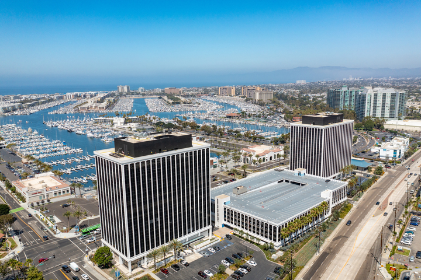
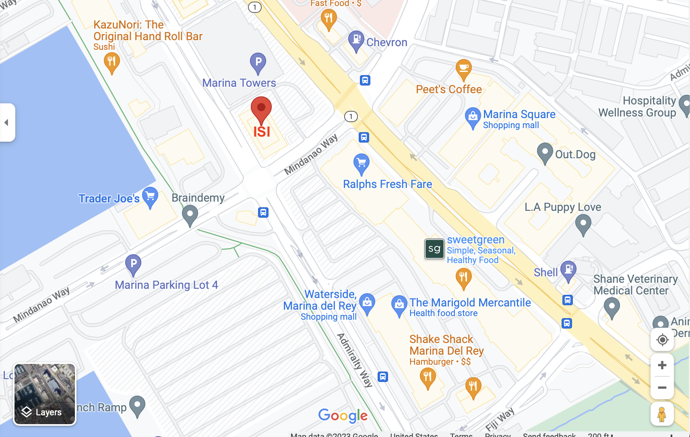

# Around the Marina

Here is what you need to know about the [Information Sciences Institute](https://www.isi.edu) and Marina Del Rey.

## Getting to Marina Del Rey

ISI is located in Marina Del Rey, CA:

4676 Admiralty Way, Suite 1001  
Marina del Rey, CA 90292  

[Directions](https://goo.gl/maps/2f9C6U5hdMS3SQut9)

Cab fare is approximately $20-$25 from LAX and $40 from the USC main campus.

*Visitor Parking:*

You may park in either the parking lot or in the attached parking structure. Please remember to bring your parking ticket with you to be validated by ISI's receptionist on the 10th floor.  

## Getting to ISI

On the first day, head to the **10th floor** receptionist and ask for PaleoHack. We will be using the 1014 conference room so you will already be on the right floor. 

## Staying in Marina Del Rey

Because of its prime location in Los Angeles, you have many options for lodging (with varying prices);

- Hotels (we recommend using a booking site if you go through this option)
- airbnb

## Getting around

The area is safe and the best way might be to rent a bike. Your best bet is to head towards Venice beach and try many of the shops there. 

Public transportation in Marina Del Rey is through Metro, the Culver City Green Bus Line, and the  Santa Monica Big Blue Bus. There also more local options such as a waterbus that can get you from one side of the Marina to the other in a fun way. For more information, see [this website](https://visitmdr.com/plan-your-visit/transportation).

## Fun in the Marina

There are plenty of activities in MDR: from just hanging out at Venice Beach, surfing, riding a bike along the ocean, kayaking or paddle boarding, there is something for everyone! So bring a swimsuit. 

## Meals

We will not be providing any meals (your participant support should cover them). There are many options to eat near ISI, including two shopping malls with several lunch options within a 5min walk from the building. The area across Mindanao has a Ralphs along with other dining options such Chipotle, Mendocino Farms (sandwich and salads), California Pizza Kitchen, a burger place. The other mall on the other side of Lincoln (Marina Square Shopping Mall) also contains dining options. There is a Trader Joe's across the street from the building. 

