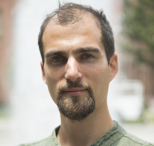
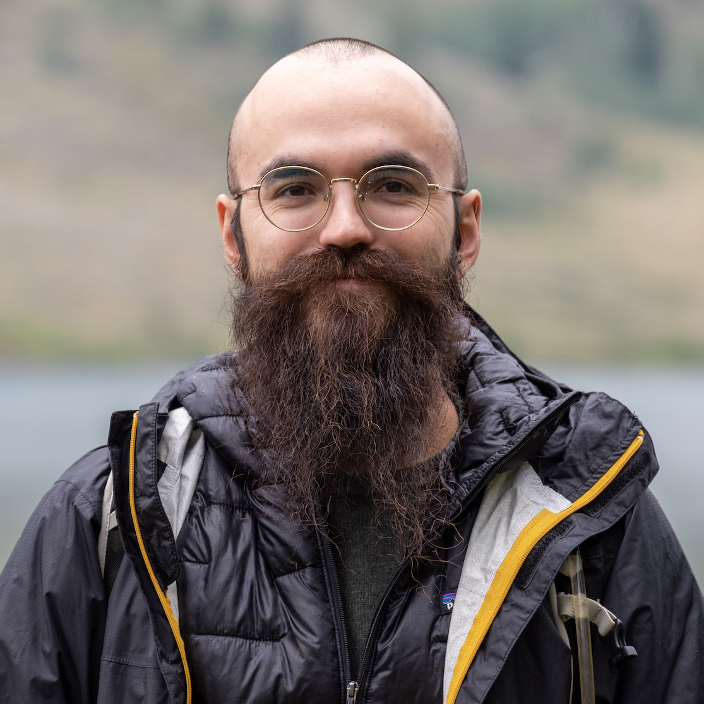

# Organizers

[Julien Emile-Geay](https://scholar.google.com/citations?hl=en&user=OVti4jEAAAAJ&view_op=list_works&sortby=pubdate), Department of Earth Sciences, University of Southern California
---

[Deborah Khider](https://www.isi.edu/people/dkhider/about), Information Sciences Institute, University of Southern California
---

[Nick McKay](https://directory.nau.edu/person/npm4), School of Earth and Sustainability, Northern Arizona University
---

[Feng Zhu](https://earth.usc.edu/~fengzhu/), Department of Earth Sciences, University of Southern California
---

Alexander James, Department of Earth Sciences, University of Southern California
